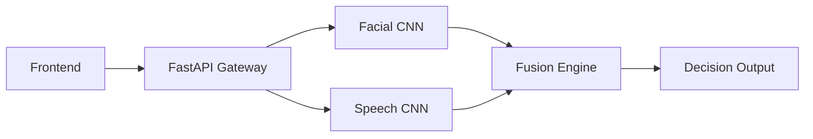

# Emotion-Driven Decision System 🧠🚀

> **Final Year Project** | **Focused on Multimodal Deep Learning**

A full-stack web application that uses multimodal deep learning to analyze emotions from facial expressions and speech, providing intelligent decision support based on detected emotional states.

## 🌟 Key Features

- **Facial Emotion Recognition**: Real-time analysis from images or live webcam feeds.
- **Speech Emotion Recognition**: High-precision detection from audio recordings or microphone input.
- **Multimodal Fusion**: Advanced engine that combines facial and speech emotions for higher decision accuracy.
- **Actionable Insights**: An intelligent decision engine that provides recommendations based on emotional context.
- **Modern UI/UX**: A sleek, responsive dashboard built with vanilla web technologies for speed and portability.

## 🛠️ Tech Stack

### Backend
- **Framework**: FastAPI (Python)
- **Deep Learning**: TensorFlow/Keras
- **Audio Processing**: Librosa
- **Image Processing**: OpenCV

### Frontend
- **Languages**: HTML5, CSS3, JavaScript (ES6+)
- **Visuals**: Chart.js / Custom CSS Animations
- **Icons**: FontAwesome / Lucide

## 🏗️ Architecture



## 🚀 Quick Start

### 1. Backend Setup
1. Navigate to `backend/`
2. Create virtual environment: `python -m venv venv`
3. Activate:
   - Windows: `.\venv\Scripts\activate`
   - Linux: `source venv/bin/activate`
4. Install: `pip install -r requirements.txt`
5. Place models in `backend/models/`:
   - `facial_model.h5`
   - `speech_model.h5`
6. Run: `uvicorn app.main:app --reload`

### 2. Frontend Setup
1. Navigate to `frontend/`
2. Option 1: Open `index.html` directly.
3. Option 2: Run `python -m http.server 8080`.

## 📁 Project Structure

```text
emotion-decision-system/
├── backend/
│   ├── app/                  # FastAPI logic
│   ├── models/               # Pre-trained .h5 models
│   └── requirements.txt      # Python dependencies
├── frontend/
│   ├── index.html            # Main entry
│   ├── css/                  # Styling
│   └── js/                   # Interaction logic
├── .gitignore                # Git exclude rules
├── LICENSE                   # MIT License
└── README.md                 # Documentation
```
## Screenshots


## 📝 License

Distributed under the MIT License. See `LICENSE` for more information.

---
*Created with ❤️ by Kandagatla Sai Vardhan*
